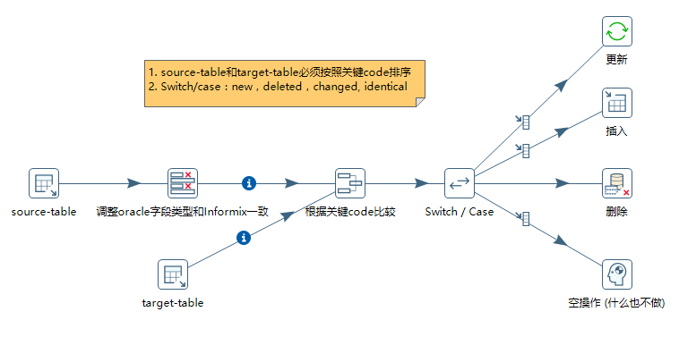

## kettle-SyncFTP
使用Kettle完成通用DB数据获取生成指定分隔符的文件并通过FTP上传的功能

* [概要说明](./Sample-FTP/readme.md)
* [**具体功能**](https://www.cnblogs.com/missfox18/p/7642026.html)

## 不基于时间戳的简单增量同步
* [kettle+linux+jenkins](https://missfoxw.github.io/pdi-kettle/#/%E5%AE%8C%E6%95%B4%E7%9A%84%E5%BC%80%E5%8F%91%E5%AE%9E%E4%BE%8B/README?id=_82-%e4%b8%80%e6%ac%a1linux%e5%bc%80%e5%8f%91%e6%a1%88%e4%be%8b)
* 场景：B业务系统提供数据，DB->Oracle；A业务系统需要周期对B系统现网数据进行增量同步，DB->Informix。

